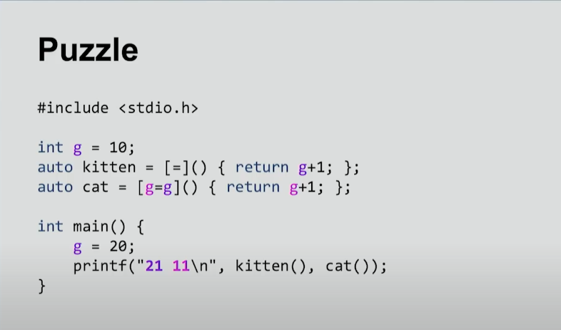
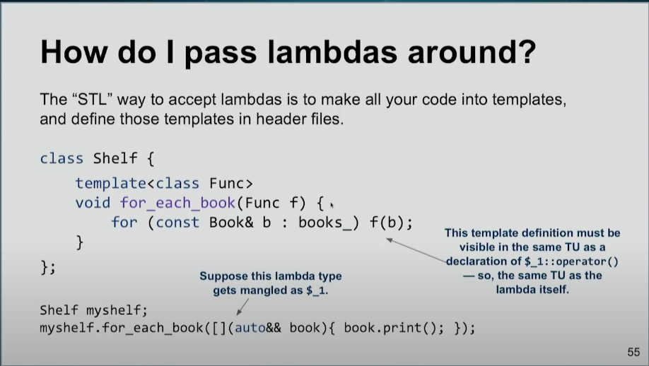
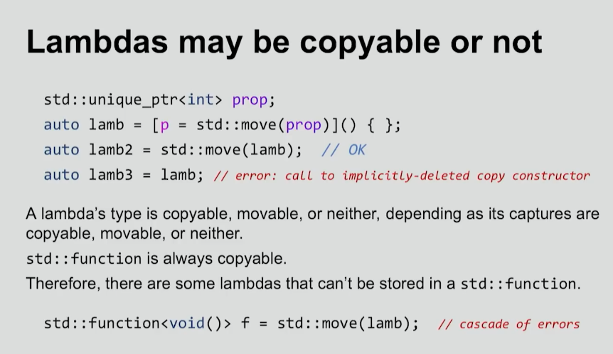

## Lambdas in C++

```cpp
class Plus {
    int value;
public:
    Plus(int v): value(v) {}
    int operator() (int x) const {
        return x + value;
    }
};

// The above thing can be achived as (lambdas reduce boilercode):

auto plus = [value = 1] (int x) {
    return x + value;
};

// this plus is basically an object of some class whose name I can't spell.
// it has a data member `value` (captures)
``` 

`lambda` is object of some anonymous class, but the `this` keyword inside this
lambda won't work as usual. It wouldn't point to this object. Rather `this`
inside a lambda refers to the `this` of outer context (wherever this lambda is
being declared)!


Here `kitten` makes a copy when it needs.

`cat` makes a copy when initialised.

> By default, lambdas that capture variables by value are const (meaning you 
cannot modify the captured variables inside the lambda). If you want to modify 
the captured value, you can use the mutable keyword.

Sending lambda as a parameter to the function:


Alternatively we can use `std::function` in the parameter type and
pass a lambda to it.

Copying of lambdas:

