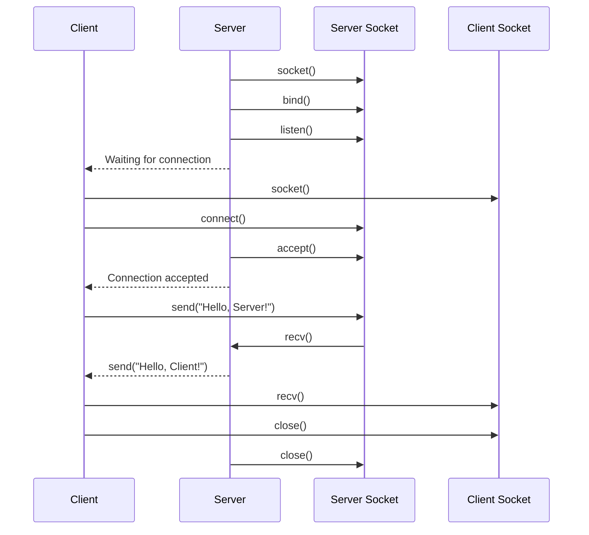

# Linux Socket API

`Server`: This is the component which listens for connections.

`Client`: It sends a connect request to the server. This is the component, which
initiates a connection.

### Client Side

`socket`: It just creates a file descriptor, but doesn't do anything more!

`connect`: Takes a file descriptor and server's address & sends a connection
request to the server.

`send & recv`: Given a connected file descriptor, submit bytes to the OS for
delivery and ask OS to deliver the bytes. (Similar to read/write.)
- These functions don't do the actual transfer of bytes, they are just asking the
OS to do these things.

`close`: Given a connected file descriptor, it tells the OS that this connection
can be terminated.
- Kernel continues sending the buffered bytes.
- At the end of buffered bytes, sends special 'EOF' message: which tells the receiver
that I am done sending, and will close the connection, you can close too!

### Server Side

`bind`: Given a file descriptor, tells the kernel to associate it with the 
given IP and port (Making a reservation at this address.)

`listen`: Given a file descriptor that has been binded to a IP/Port, it now asks
the PS that it wishes to start receiving connections.

`accept`: Given a fd which is listening, it creates a `new fd` that can be used to
communicate with individual client. This call is blocking by default, until a 
client shows up.
- Note that here a new fd has been created to talk to this client. The old fd is
not for sending/receiving messages from the client. It is just used for accepting
connections from the client.

*Keeping track of the return values of send/recv are very crucial. The returned
bytes may be less than what you asked for. So keep trying until you have received
what you wanted.
You are only submitting the bytes to the operating system, not actually sending
them to the server.*
