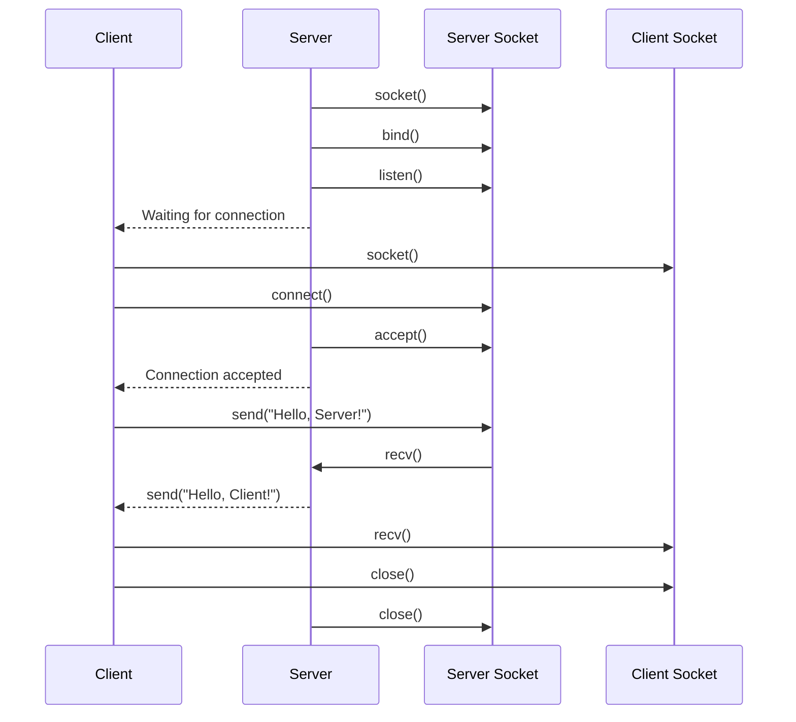
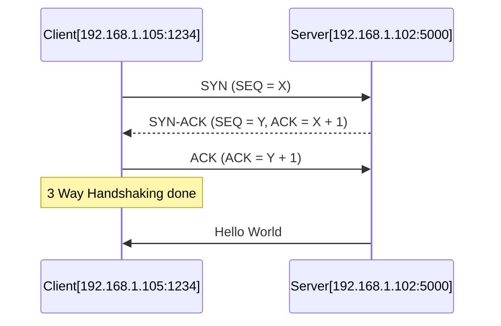
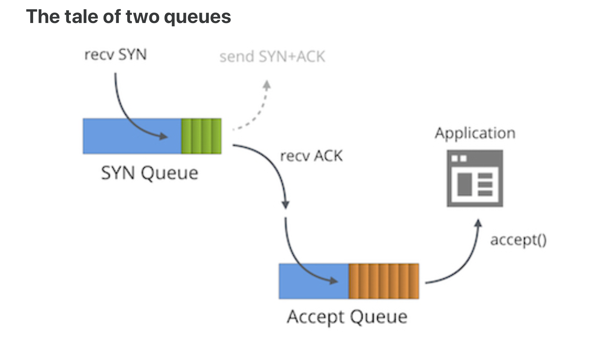

# LINUX Networking

## High Level Socket API

1. [CS361 Video](https://youtu.be/XXfdzwEsxFk?si=VGb5lymk8Fkaglqk)
2. [Video on Protocol Stack](https://www.youtube.com/watch?v=3b_TAYtzuho)

`Server`: This is the component which listens for connections.

`Client`: It sends a connect request to the server. This is the component, which
initiates a connection.

### Client Side

`socket`: It just creates a file descriptor, but doesn't do anything more!

`connect`: Takes a file descriptor and server's address & sends a connection
request to the server.

`send & recv`: Given a connected file descriptor, submit bytes to the OS for
delivery and ask OS to deliver the bytes. (Similar to read/write.)
- These functions don't do the actual transfer of bytes, they are just asking the
OS to do these things.

`close`: Given a connected file descriptor, it tells the OS that this connection
can be terminated.
- Kernel continues sending the buffered bytes.
- At the end of buffered bytes, sends special 'EOF' message: which tells the receiver
that I am done sending, and will close the connection, you can close too!

### Server Side

`bind`: Given a file descriptor, tells the kernel to associate it with the 
given IP and port (Making a reservation at this address.)

`listen`: Given a file descriptor that has been binded to a IP/Port, it now asks
the OS that it wishes to start receiving connections.

`accept`: Given a fd which is listening, it creates a `new fd` that can be used to
communicate with individual client. This call is blocking by default, until a 
client shows up.
- Note that here a new fd has been created to talk to this client. The old fd is
not for sending/receiving messages from the client. It is just used for accepting
connections from the client.

*Keeping track of the return values of send/recv are very crucial. The returned
bytes may be less than what you asked for. So keep trying until you have received
what you wanted.
You are only submitting the bytes to the operating system, not actually sending
them to the server.*

## How The Kernel Handles A TCP Connection

Packets and Syscall Analysis:  [Video](https://www.youtube.com/watch?v=ck4WvYM9V4c)

### TCP Three-Way Handshake Overview

### Using `ncat`

- Creating server: `ncat -l 1234`

	- `-l`: Tells Ncat to listen for incoming connections.
    - `1234`: The port where Ncat is listening for connections.
- Connect to a server: `ncat <ip> <port>`

- Create UDP server: `ncat -l -u 1234`
- Connect to UDP server: `ncat -u <ip> <port>`

### Server Side Analysis

The following events happen while running `ncat` on the server side:

1. `socket` system call: It requests an ipv4 socket to be created. 
On success, it returns a file descriptor for the newly created 
socket (let fd = 3).

2. `bind` system call: It takes a file descriptor (fd 3) (returned by 
socket), and binds it to an ip address and port. Socket itself is 
just a data structure with a buffer. We need to bind it. 

3. `listen` system call: Listens on this socket for any `TCP SYN`
request.

4. Then we make a `select` system call. This call waits on a file descriptor 
(fd 3),
until its available for read or write. This is generally used in IO multiplexing.
In our case, we wait on the socket's fd. Here are waiting for someone to send 
connection requests, since we are listening for connection. The `ncat` process
is wait-blocked at this moment. It is unblocked, when some desirable event occurs.

5. When it is unblocked, it means a `syn` request has arrived, and kernel has
completed 3-way handshake with the client. 
Thus `accept` system call is ran on this fd 3. The accept system call on success
returns a new data socket for that connection. A `new fd (let fd 4)` is now
created to talk to this client.
 
6. `close` system call is called on fd 3 (this is specific to ncat, since it only
accepts on client connection).   

7. We then make `select` system call on fd = 0, 4. `fd 0` is for stdin, incase we 
want to send some data to client and `fd 4` is the data socket, which will tell
if we have something to read.

Suppose we receive a packet over wifi; an interrupt will be raised and 
corresponding interrupt handler will be called. 
Inside the kernel thread running the interrupt handler, we consume the packet
from the buffer, create `skb` struct (socket kernel buffer).
After consuming, we copy the packet into the socket buffer of the `ncat`. At 
this point the `select` syscall (waiting on this fd) of the user process returns. 

### Handshaking from Process' POV
The protocol stack of Linux does the handshaking without involving the application.

The kernel unblocks the process waiting on `select` syscall (while listening
for new connection), only when the handshake is completed. The user process is not
involved in the handshake. 
It only receives the last `ack` of 3-way handshake. On receiving, it can accept
the new connection and can  start to `send/recv` data.

*Note that size of accept queue is bounded. If we don't accept the ready connections, new connections would be dropped* 

### ACKs
Even the `acks/retransmissions` are handled by the kernel's protocol stack. 
The application is not notified about this. The TCP header contain flags, which
tell if it contains some data or ack. Based on the flag, the protocol stack takes
appropriate decisions. 

Generally the user process if only unblocked (from `select` syscall), when the
kernel copies some useful data into the fd's read buffer, which the process can
consume. 

### Some benchmarks

*take it with pinch of salt*
 
- From receiving interrupt for SYN to accepting the connection: 1.7 ms 
(*It actually depends between the distance between client and server, as 2 more
exchanges are involved in between. This data is from localhost I think*) 

-  Processing a packet interrupt: 200 microseconds
