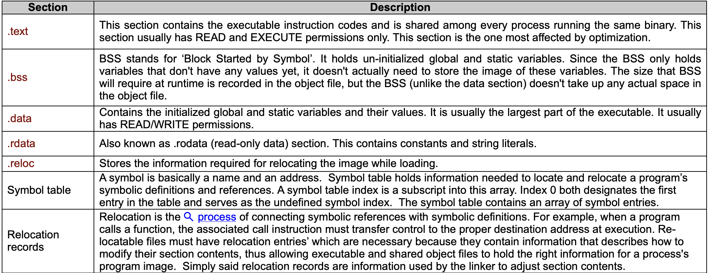
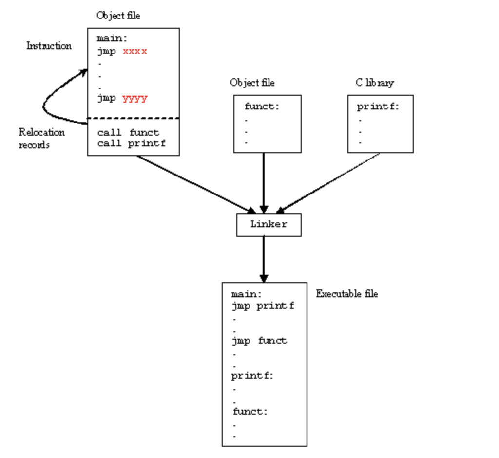

## Story of the Program to a Process

`Preprocessing` is the first pass of any C++ compilation. It processes
include-files, conditional compilation instructions and macros.

`Compilation` is the second pass. It takes the output of the 
preprocessor, and the source code, and generates assembly source code.

`Assembler` is the third stage of compilation. It takes the assembly
source code and produces machine code with offsets. The
assembler output is stored in an object file.

`Linking` is the final stage of compilation. It takes one or more
object files or libraries as input and combines them to produce a
single (usually executable) file. In doing so, it resolves references
to external symbols, assigns final addresses to procedures/functions 
and variables, and revises code and data to reflect new addresses (a 
process called relocation).

### Object Files

After the source code has been assembled, it will produce an Object
files `(e.g. .o, .obj)` and then linked, producing an executable files.

An object and executable come in several formats such as `ELF`
(Executable and Linking Format) and `COFF` (Common Object-File Format).  
For example, ELF is used on Linux systems, while COFF is used on 
Windows systems.

The object file contains various areas called sections. These sections can
hold executable code, data, dynamic linking information, debugging data, 
symbol tables, relocation information, comments, string tables, and notes.

Some sections are loaded into the process image and some provide 
information needed in the building of a process image while still others 
are used only in linking object files.

`readelf` and `objdump` can be use to read headers and content of an object
file.

### Relocation Records:
Because the various object files will include references to each other's code
and/or data, these shall be combined during the link time.

For example, the object file that has main() includes calls to 
function printf().

After linking all of the object files together, the linker uses the 
relocation records to find all of the addresses that need to be filled in.

Each object file has a symbol table that contains a list of names and their
corresponding offsets in the text and data segments.

### Shared Libraries

- In a typical system, a number of programs will be running. Each program 
relies on a number of functions, some of which will be standard C library 
functions, like `printf()`, `malloc()`, `strcpy()`, etc. and some are 
non-standard or user defined functions.

- If every program uses the standard C library, it means that each program 
would normally have a unique copy of this particular library present within 
it. Unfortunately, this result in wasted resources, degrade the efficiency 
and performance.

- Since the C library is common, it is better to have each program reference 
the common, one instance of that library, instead of having each program 
contain a copy of the library.

- This is implemented during the linking process where some of the objects are linked during the link time whereas some done during the run time 
(Dyanimic Linking).

#### Static Linking
- The term `statically linked` means that the program and the particular 
library that it’s linked against are combined together by the linker at link 
time.

- Programs that are linked statically are linked against archives of objects 
(libraries) that typically have the extension of `.a`.  An example of such a 
collection of objects is the standard C library, `libc.a`.

- You might consider linking a program statically for example, in cases 
where you weren't sure whether the correct version of a library will be 
available at runtime, or if you were testing a new version of a library that 
you don't yet want to install as shared.

- The drawback of this technique is that the executable is quite big in 
size, as all the needed information need to be brought together.

#### Dynamic Linking
- The term `dynamically linked` means that the program and the particular library it references are not combined together by the linker at link time.

- Instead, the linker places information into the ELF that tells the 
loader which `shared object module` the code is in and which
`runtime linker` should be used to find and bind the references.

- This type of program is called a partially bound executable, because it 
isn't fully resolved. The linker, at link time, didn't cause all the 
referenced symbols in the program to be associated with specific code from 
the  library. Instead, the linker simply said something like: “This 
program calls some functions within a particular shared object, so I'll just 
make a note of which shared object these functions are in, and continue on”.

- The binding between the program and the shared object is done at runtime 
that is <mark> after the program starts </mark>, the appropriate shared 
objects are found and bound.

- Programs that are linked dynamically are linked against shared objects 
that have the extension `.so`. An example of such an object is the shared 
object version of the standard C library, `libc.so`.

- Some advantages:
    - Program files (on disk) become much smaller because they need not hold
     all necessary text and data segments information.
    
    - Dynamic linking permits two or more processes to share read-only 
    executable modules such as standard C libraries.  Using this technique, 
    only one copy of a module needs be resident in memory at any time, and 
    multiple processes, each can executes this shared code (read only).  
    This results in a considerable memory saving.

### Process Loading

1. In Linux processes loaded from a file system (using either the 
`execve()` or `spawn()` system calls) are in `ELF` format.

2. Before we can run an executable, firstly we have to load it into memory.

3. This is done by the loader, which is generally part of the operating system.

4. Memory and access validation: Firstly, the OS system kernel reads in the 
program file’s header information and does the validation for type, access 
permissions, memory requirement and its ability to run its instructions.  It 
confirms that file is an executable image and calculates memory requirements.

    - Allocates primary memory for the program's execution.
    - Copies address space from secondary to primary memory.
    - Copies the `.text` and `.data` sections from the executable into primary 
    memory.
    - Copies program arguments (e.g., command line arguments) onto the stack.
    - Initializes registers: sets the esp (stack pointer) to point to top of
    stack, clears the rest.
    - Jumps to `__start` routine, which: copies main()'s arguments off of the 
    stack, and jumps to `main()`.

5. The memory layout, consists of three segments (text, data, and stack).
The dynamic data segment is also referred to as the heap, the place dynamically 
allocated memory (such as from `malloc()` and `new()`) comes from. Dynamically 
allocated memory is memory allocated at run time instead of compile/link time.

### Runtime Linking

1. The runtime linker is invoked when a program that was linked against a 
shared object requests that a shared object be dynamically loaded.

2. Run-time dynamic linking: The application program is read from disk (ELF 
file) into memory and unresolved references are left as invalid (typically 
zero).  The first access of an invalid, unresolved, reference results in a 
software trap.  The run-time dynamic linker determines why this trap occurred 
and seeks the necessary external symbol.  Only this symbol is loaded into 
memory and linked into the calling program.

3. The runtime linker is contained within the C runtime library. The runtime 
linker performs several tasks when loading a shared library (`.so` file).

4. For resolving a symbol at runtime the runtime linker will search through the 
list of libraries for this symbol.  In ELF files, hash tables are used for the 
symbol lookup, so they're very fast.

