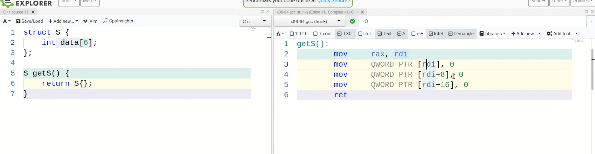
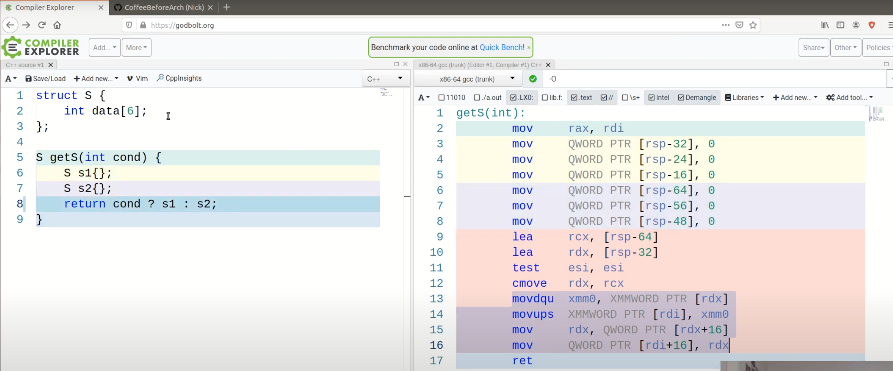

## Return Value Optimisation

The object to be returned is constructed in the returne value slot. 
Expensive copying is avoided in this case. Otherwise the object would be first 
created in local stack and then copied into the return slot (copying involved).

Good Video by Arch Coffee: https://www.youtube.com/watch?v=Qp_XA8G5H3M

*Here we can see that the un-named object S{} is directly created in the return
value slot. 
We have avoided unnecessary copying.*

*In this case the compiler doesn't know which among `s1`, `s2` needs to be returned.
Hence it can't directly constuct the object in the return slot. It first creates
both the objects in the stack and then based on the conditional test, copies one
of them into the return value slot.*
