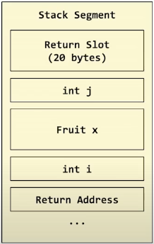

## Return Value Optimisation

The object to be returned is constructed in the return value slot. 
Expensive copying is avoided in this case. Otherwise the object would be first 
created in local stack and then copied into the return slot (copying involved).

Good Video by Arch Coffee: https://www.youtube.com/watch?v=Qp_XA8G5H3M


*Here we can see that the un-named object S{} is directly created in the return
value slot. 
We have avoided unnecessary copying.*


*In this case the compiler doesn't know which among `s1`, `s2` needs to be returned.
Hence it can't directly constuct the object in the return slot. It first creates
both the objects in the stack and then based on the conditional test, copies one
of them into the return value slot.*

### Understanding stack segment while function call

This is how the stack looks like. First of all we have the return slot.
Then the arguments to the function and finally the return address.
Stack pointer points below this at start of first instuction.

```cpp
Fruit apples_to_apples (int i, Fruit x, int j) {
    return x
}
```
<mark/>The return slot is allocated by the `caller` itself. And its address is passed to
the `callee` via the `rdi` register (this is a hidden parameter in this case).<mark>

<mark/>In case of RVO, the returned object will be constructed in this slot, otherwise it would
be created locally in stack and then copied here.<mark>




Here we can't elide copy, since the stack address of Fruit x and the return
slot are different. We must get data out of `x` and put it into the return slot.

### Slicing from derived to base

```cpp
struct Cat : Aniaml {
    int rats_eaten;
}

Animal chopped() {
    Cat x = ...;
    return x;
}
```

In this case we do control the physical location of x (where we can constuct it),
but x is of the wrong type for constructing into the return slot.
(*Slot of Animal return would be smaller size than Cat object size*).

In these cases, where return type is Base and the object returned is Derived,
the extra properties of the derived object is sliced away. We will only be 
returning the Animal part now. 
(*To avoid this, we use pointers. Run-Time Polymorphism*)
