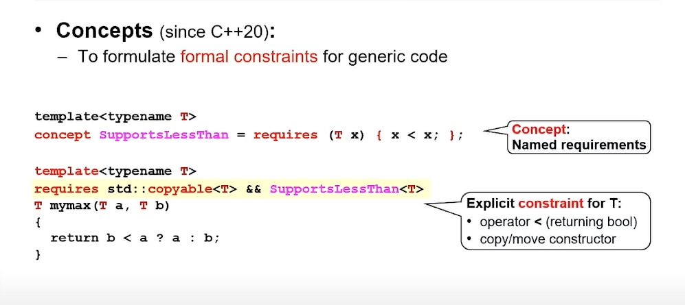

## C++ Template

Template is not a thing: Its a recipe for making things.

### Function Templates
These are the recipes for making functions.
```cpp
template<class T>
T const& min(T const& a, T const& b) {
    return (a < b) ? a : b;
}

template(class RandomIt, class Compare) 
void sort(RandomIt first, RandomIt last, Compare comp);
```
### Class Templates
These are the recipes for making classes
```cpp
template<class T, size_t N>
struct array {
    ...
}
```
### Alias Templates (C++11)
These are recipes for making type aliases.
```cpp
template<class Key, class Val>
using my_map = map<Key, Value, greater<Key>>;

my_map<std::string, int> msi;
```

*If some `if/else` decision can be taken at compile time, then there
is no branching at run time, which is pretty efficient. 
Hence try to take more and more decisions at compile time.*

We put the `recipe` in the header files and include these header files
in all those source files where need to instantiate.
The compiler needs to see the recipe for making actual things.

These template definitions (recipe) are treated as `inline`.

`inline`: inline function and variables can have multiple definitions 
across different translation units (All definitions of the inline function must be identical across all translation units).

In simple words, it means that we can place declaration and definition
inside the header file and then include this header file in different
source files. This way we can have multiple definitions but each
definition is identical.

#### Concepts
We can use them to put some constraints for generic code. 
Because templates are just recipes, they are only instantiated when someone calls
them. So compiler will only generate actual thing upon being called. 

Could be used when we need to check if certain templated function has `push_back`
inside it and we don't call it with `set` container.
```cpp
template<typename Coll>
concept HasPushBack = requires (Coll c, Coll::value_type v) {
    c.push_back(v);
};
// this just checks that would calling push_back be valid or not?
```



#### Variadic Templates

```cpp
#include <iostream>

// Base case: This function is called when there's only one argument left
template <typename T>
T sum(T value) {
    return value;
}

// Variadic template: This function is called with two or more arguments
template <typename T, typename... Args>
T sum(T first, Args... args) {
    return first + sum(args...);  // Recursively call sum with the remaining arguments
}

int main() {
    std::cout << "Sum of 1, 2, 3, 4, 5: " << sum(1, 2, 3, 4, 5) << std::endl;
    std::cout << "Sum of 1.5, 2.5, 3.5: " << sum(1.5, 2.5, 3.5) << std::endl;
    std::cout << "Sum of 10: " << sum(10) << std::endl;  // Single argument case
    return 0;
}
```

### Compile time prime checker

But there is a limit in maximum depth of template class instantiation in compiler.


```cpp
#include <iostream>

// Base case: Primary template to check divisibility
template<int num, int divisor>
struct IsPrimeHelper {
    static constexpr bool value = (num % divisor != 0) && IsPrimeHelper<num, divisor - 1>::value;
};

// Specialization for the base case when divisor reaches 1
template<int num>
struct IsPrimeHelper<num, 1> {
    static constexpr bool value = true;
};

// Specialization to handle numbers less than 2 (not prime)
template<>
struct IsPrimeHelper<1, 1> {
    static constexpr bool value = false;
};

// Main template to check if a number is prime
template<int num>
struct IsPrime {
    // The helper is instantiated with num and num / 2 as the starting divisor
    static constexpr bool value = (num > 1) && IsPrimeHelper<num, num / 2>::value;
};

int main() {
    // Check if 29 is prime
    constexpr int number1 = 29;
    constexpr bool isNumber1Prime = IsPrime<number1>::value;
    std::cout << number1 << (isNumber1Prime ? " is prime." : " is not prime.") << std::endl;

    // Check if 10 is prime
    constexpr int number2 = 10;
    constexpr bool isNumber2Prime = IsPrime<number2>::value;
    std::cout << number2 << (isNumber2Prime ? " is prime." : " is not prime.") << std::endl;

    return 0;
}
```

```cpp
#include <iostream>

// Helper function to check for divisibility at compile time
constexpr bool isDivisible(int num, int divisor) {
    return (num % divisor == 0);
}

// Recursive constexpr function to check if a number is prime
constexpr bool isPrimeHelper(int num, int divisor) {
    // Base case: If divisor is 1, it's prime
    if (divisor == 1) return true;
    // If the number is divisible by the current divisor, it's not prime
    if (isDivisible(num, divisor)) return false;
    // Recursively check for next divisor
    return isPrimeHelper(num, divisor - 1);
}

// Main constexpr function to check primality
constexpr bool isPrime(int num) {
    // Handle special cases for numbers less than 2
    return (num > 1) && isPrimeHelper(num, num / 2);
}

int main() {
    // Test the compile-time prime checker
    constexpr int number1 = 29;
    constexpr int number2 = 10;
    
    // These conditions are evaluated at compile time
    if constexpr (isPrime(number1)) {
        std::cout << number1 << " is prime." << std::endl;
    } else {
        std::cout << number1 << " is not prime." << std::endl;
    }

    if constexpr (isPrime(number2)) {
        std::cout << number2 << " is prime." << std::endl;
    } else {
        std::cout << number2 << " is not prime." << std::endl;
    }

    return 0;
}
```