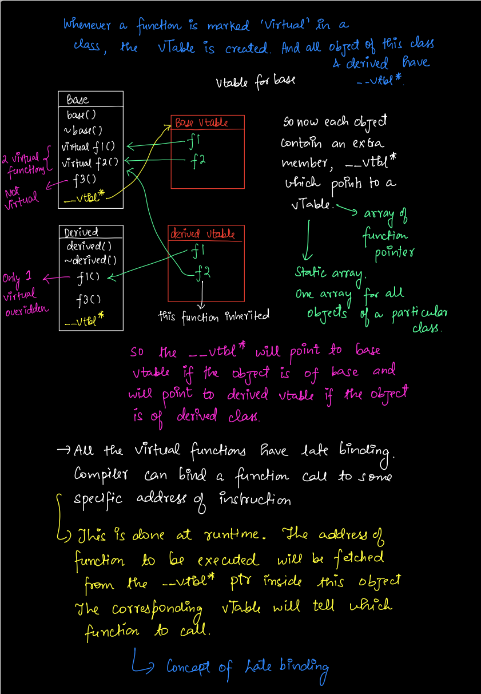

## Virtual Functions and VTables

- Used when we want to call member function of derived class by a pointer of 
base class.

```cpp
class Base {
    public:
        Base() {
            std::cout << "Base Constructed" << std::endl;
        }
        ~ Base () {
            std::cout << "Base Destructed" << std::endl;
        }
        void func() {
            std::cout << "Base member function" << std::endl;
        }
}

class Derived : public Base {
    public:
        Derived() {
            std::cout << "Derived Constructed" << std::endl;
        }
        ~ Derived () {
            std::cout << "Derived Destructed" << std::endl;
        }
        void func() {
            std::cout << "Derived member function" << std::endl;
        }
}

int main () {
    Derived instance;
    instance.func();

    // Base Constructed
    // Derived Constructed
    // Derived member function     ---> derived will be printed
    // Derived Destructed
    // Base Destructed


    Base* ptr = new Derived;
    ptr->func();
    delete ptr;

    // Base Constructed
    // Derived Constructed
    // Base member function     ---> base will be printed
    // Base Destructed

    // 2 things to note: Base member function called, and Derived not destructed.

}
```

In the above example if we wish that `func` of derived should be called then, we will have to mark the base function as `virtual` and the
derived function should override that function.

```cpp
virtual void func() {};     // in base class

void func() override {};    // in derived class

ptr->Base::func();          // to explicitly call base member function even after 
                            // declaring it virtual.
``` 

#### Both the destructors should be called!

To ensure this, mark the destructor of base class as virtual. This will ensure 
that the destructor of derived class is also called, upon object destruction.

`virtual ~Base() {}`

### Virtual Table (vTable) - Supports Dynamic Dispatch

To infer which function will be called, when we have some scenario like:

```cpp
base* ptr = &derived;
ptr->function();
```

- If `function()` is not virtual:
    - we will have `early binding` done during compile time only. The function 
    corresponding to the pointer type (here `base`) will be called.
- If `function()` is virtual:
    - we will have `late binding` done during the run time. We will *use `vtable`
    of the `derived class`* to fetch the appropriate function. If this function is
    overridden in the derived class then the vtable will point to this overridden
    function. Otherwise, if we have not overridden this function in the derived
    class, then the vtable will point to the function of base class (since all the
    base class function are inherited by the derived class).
    - Hence:
        - If overridden: call the overridden function of derived class.
        - Else call the function of base class.

[PDF version](../assets/Vtables.pdf)


